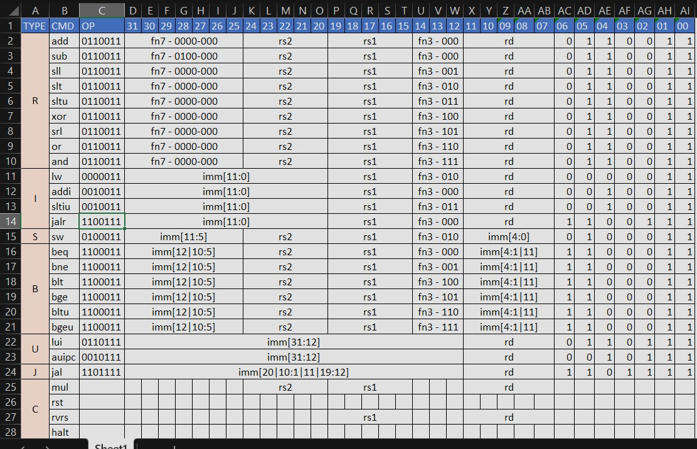

### CSE112
## Computer Organization
## Group Project

## Group Member Details:
#Devaj Rathore

#Kavya 

#Dviyanshi Beniwal

#Animish Yadav

### SIMPLE ASSEMBLER
The Code implements the  RV321 (RISC-V Subset), which reads assembly instructions from a text file and outputs 32-bit binary codes with proper data structure based on the instruction type.

The assembler and simulator support a basic set of RISC instructions, including but not limited to:

 - Arithmetic instructions (add, subtract, multiply, divide)
 - Logic instructions (AND, OR, XOR)
 - Memory instructions (load, store)
 - Control flow instructions (jump, branch)
 - Refer to the documentation or comments in the source code for the complete list of supported instructions.

## Instruction Format for all types:

## Files: 

 - SimpleAssembler.py: Contains main code
 - Input.txt: Contains Assembly Code
 - Output.txt: Contains Binary Code, populated by SimpleAssembler.py